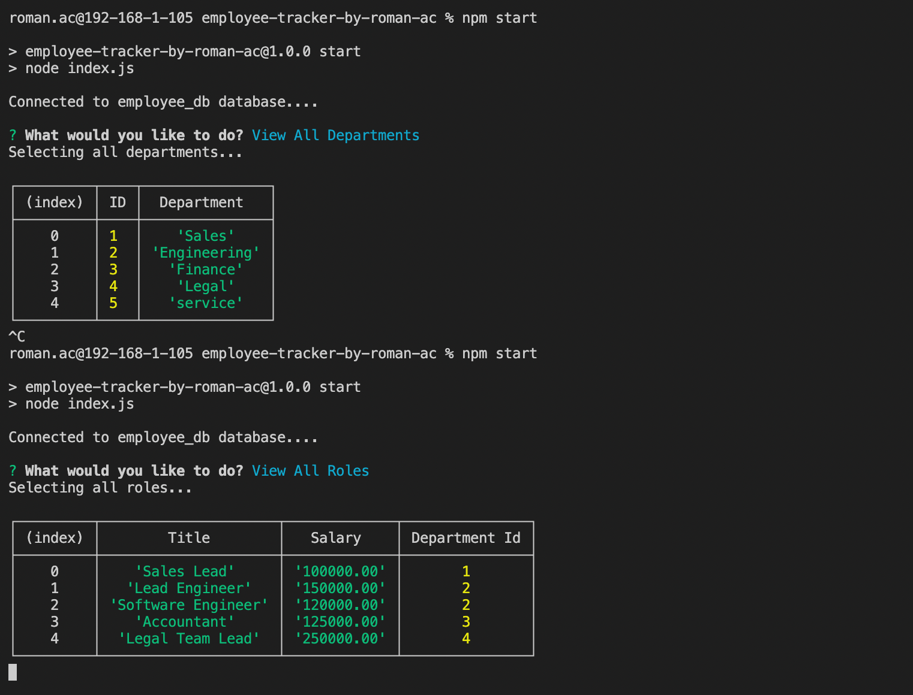

# <Employee-Tracker.>

# Mission
    * to build a command line application from scratch to manage a company's employee database, using NODE.js, Inquirer and MySQL
    * have a clean, polished and responsive user interface

# Parameters
    
    Given the command line applciation which takes the user input;

    * upon start of application,
        user is presented is presented with the following options: view all departments, view all roles, view all employees, add a department, add a role, add an employee, and update an employee role
    * when the user chooses to view all departments,
        then he/she is presented with presented with a formatted table showing department names and department ids
    * when user chooses to view all roles,
        then he/she is presented with the job title, role id, the department that role belongs to, and the salary for that role
    * when user chooses to view all employees,
        then he/she is presented with a formatted table showing employee data, including employee ids, first names, last names, job titles, departments, salaries, and managers that the employees report to
    * when user chooses to add a department,
        then user is prompted to enter the name of the department and that department is added to the database
    * when user chooses to adda role,
        then user is prompted to enter the name, salary, and department for the role and that role is added to the database
    * when user chooses to add an employee,
        then user is prompted to enter the employee’s first name, last name, role, and manager, and that employee is added to the database
    * when user chooses to update an employee role
        then user is prompted to select an employee to update and their new role and this information is updated in the database
    

# Link to the GITHUB page

https://github.com/roman-ac/employee-tracker-by-roman-ac

# Screenshots

   